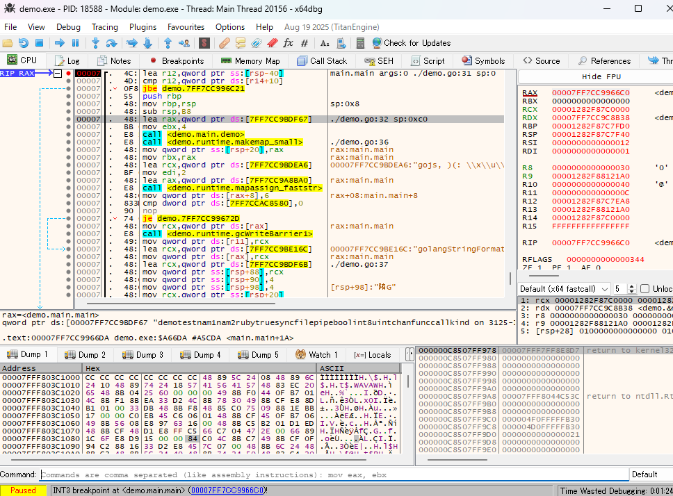
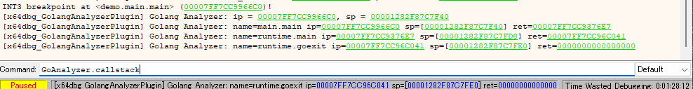

# GolangAnalyzerPlugin
GolangAnalyzer helps you analyze Golang binaries.

## Features
- Add functions
- Add source file and line number information to comments
- Show the current goroutine call stack

## Usage
1. Download the release
2. Copy x64dbg_GolangAnalyzerPlugin.dp32/x64dbg_GolangAnalyzerPlugin.dp64 files to plugins directories of x64dbg
3. Start debugging
4. `GoAnalyzer.line.enable`
5. `GoAnalyzer.analyze`

### Commands
- `GoAnalyzer.analyze`: Run the analysis
- `GoAnalyzer.line.enable`: Enable comments with source file and line number information
- `GoAnalyzer.line.disable`: Disable comments with source file and line number information
- `GoAnalyzer.gid`: Get the current goroutine ID
- `GoAnalyzer.callstack`: Show the current goroutine call stack
